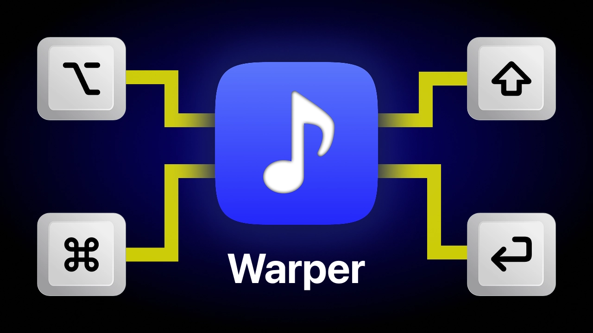

# Overview

Warper is a macOS music app inspired by Apple Music but with better keyboard shortcuts.

- **Sensible Keyboard Controls** - Scrubbing with arrow keys, navigation with Tab, and much more.

- **Optimized Search UX** - Quickly find and jump to songs without relying on a mouse.

- **Waveform Visualization** - Provides a visual cue to help skip to the right part of a song.

- **Lower CPU and RAM Usage** -  More efficient than Apple Music for offline playback.

# Development

Warper is built with Flutter Desktop for macOS. Native Swift code is used for some functionality. After installing Flutter, run `flutter pub get` in the project and press F5 in VSCode to run the project in debug mode.

If you find a bug with Warper or want to request a feature, create a GitHub issue at https://github.com/TastemakerDesign/Warper/issues.

# Links

- Download Link - https://github.com/TastemakerDesign/Warper/releases

- Demo Video - https://www.youtube.com/watch?v=li85BsDyPk0

- Tastemaker Design - https://tastemaker.design/
